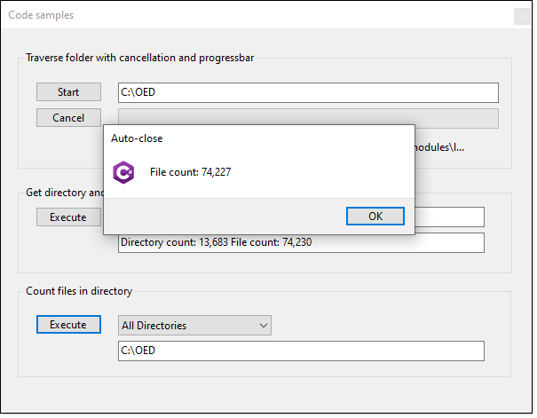
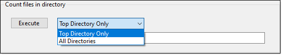
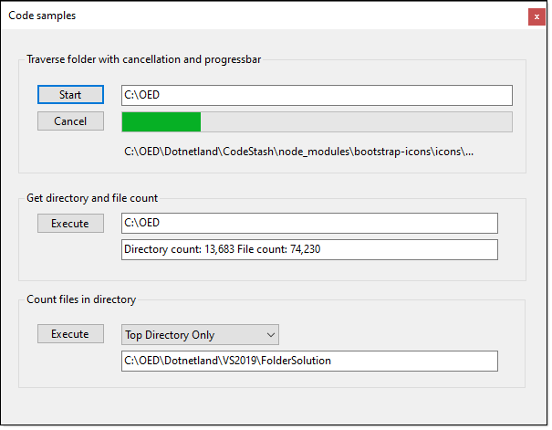

# Learn how to work with large folder for searching and more


This article focuses on how to perform a basic search through a folder structure in search of a specific pattern e.g. all text files, all .jpg files which keeps the front-end user interface response. There is code to show how to get a file count of files in a folder and also methods to return both folder and file count.

All code is in a class project which targets .NET Core 5 which by changing to .NET Core 6 and higher will work. A Windows Form project is used to demonstrate the methods presented below. Since all methods are in a class project they can be called by Windows Forms and WPF, have not tested with MAUI which is cross-platform which may present issues on non-windows operating systems.

# Obtaining file count in a folder



The following method provides an extremely fast way to get all files in a folder for all files in the folder and sub-folders.

```csharp
public static int FileCount(string directory)
{
    DirectoryInfo dirInfo = new(directory);
    return dirInfo.EnumerateDirectories().AsParallel()
        .SelectMany(di => di.EnumerateFiles("*.*", SearchOption.AllDirectories)).Count();
}
```

We can have an overload which has the option to just perfom a file count on the specified directory by allowing the caller to specify via SearchOption Enum [](https://docs.microsoft.com/en-us/dotnet/api/system.io.searchoption?view=net-6.0).

```csharp
public static int FileCount(string directory, SearchOption searchOption)
{
    DirectoryInfo dirInfo = new(directory);
    return dirInfo.EnumerateDirectories().AsParallel()
        .SelectMany(di => di.EnumerateFiles("*.*", searchOption)).Count();
}
```

The above methods don’t cover insufficient access permissions `UnauthorizedAccessException` [](https://docs.microsoft.com/en-us/dotnet/api/system.unauthorizedaccessexception?view=net-6.0), for this the following will provide protection from a runtime exception. 

```csharp
public static (int count, Exception exception) FileCountSafe(string directory, SearchOption searchOption, string searchPattern = "*.*")
{
    try
    {
        DirectoryInfo dirInfo = new(directory);
        return (dirInfo.EnumerateDirectories().AsParallel().SelectMany(di => di.EnumerateFiles(searchPattern, searchOption)).Count(), null);
    }
    catch (Exception localException)
    {
        return (-1, localException);
    }
}
```

The following method accepts a folder and returns a count of directories and file count.

```csharp
public static (int directoryCount, int fileCount) DirectoryFileCount(string directory)
{
    Dictionary<bool, int> dictionary = new DirectoryInfo(directory)
        .EnumerateFileSystemInfos("*", SearchOption.AllDirectories)
        .GroupBy(fsi => fsi is DirectoryInfo)
        .ToDictionary(item => item.Key, s => s.Count());

    return (dictionary.ContainsKey(true) ? dictionary[true] : 0, dictionary.ContainsKey(false) ? dictionary[false] : 0);
}
```

In the user interface



The Combobox definition

```csharp
public class SearchOptionComboBox : ComboBox
{
    public SearchOptionComboBox()
    {
        Size = new Size(173, 23);
        DropDownStyle = ComboBoxStyle.DropDownList;
        DataSource = FileOperations.SearchOptions();
    }

    public SearchOptionItem SelectedOption() => (SearchOptionItem)SelectedItem;
}
```

Which uses the following model to present the `SearchOption` Enum.

```csharp
public class SearchOptionItem
{
    /// <summary>
    /// Text to display
    /// </summary>
    public string Text { get; }
    /// <summary>
    /// Actual value
    /// </summary>
    public SearchOption Value { get; }

    public SearchOptionItem(string text, SearchOption value)
    {
        Text = text;
        Value = value;
    }

    public override string ToString() => Text;
}
```

And the following method used in `SearchOptionItem` class/model.

```csharp
public static List<SearchOptionItem> SearchOptions() => 
    Enum.GetValues(typeof(SearchOption)).Cast<SearchOption>()
        .Select(x => new SearchOptionItem(x.ToString()
            .SplitCamelCase(), x)).ToList();
```

# How to traverse a folder

The following method enumerates a folder, optionally sub-folders with a simple search pattern and in the while statement sends the file to a listener via a delegate/event.

```csharp
public async Task EnumerateFiles(string directory, string searchPattern, SearchOption searchOption, CancellationToken ct)
{
    using var enumerator = await Task.Run(() => Directory.EnumerateFiles(directory, searchPattern, searchOption).GetEnumerator(), ct);
    while (await Task.Run(() => enumerator.MoveNext(), ct))
    {
        Traverse?.Invoke(enumerator.Current);
    }

    Done?.Invoke();
}
```

In a form, button click event

1. Assert there is a value in a TextBox to work with
2. Assert the folder actually exists
2. A CancellationTokenSource [](https://docs.microsoft.com/en-us/dotnet/api/system.threading.cancellationtokensource?view=net-6.0) provides the ability to cancel the operation which can be done in another button (see code sample), it is a private variable so there is code to reinitialize.
4. Reset a ProgressBar used to show progress and reset a label to show the current file being iterated.
5. Setup events to get results and be notified when finish iterating the folder
6. Wrap the operation in a try-catch statement for handling a cancellation of the operation. You may want to check for other exceptions.
 

```csharp
private async void StartButton1_Click(object sender, EventArgs e)
{

    if (string.IsNullOrWhiteSpace(FolderTextBox1.Text)) return;

    if (!Directory.Exists(FolderTextBox1.Text))
    {
        return;
    }

    if (cancellationTokenSource.IsCancellationRequested)
    {
        cancellationTokenSource.Dispose();
        cancellationTokenSource = new CancellationTokenSource();
    }

    progressBar1.Maximum = DirectoryHelpers.FileCount(FolderTextBox1.Text) +1;
    progressBar1.Value = 0;

    FileOperations operations = new();

    operations.Traverse += OperationsOnTraverse;
    operations.Done += OnDone;

    try
    {
        await operations.EnumerateFiles(
            FolderTextBox1.Text, 
            "*.*", 
            SearchOption.AllDirectories, 
            cancellationTokenSource.Token);
    }
    catch (Exception exception)
    {
        if (exception is OperationCanceledException)
        {
            Dialogs.AutoCloseDialog(
                this, 
                Properties.Resources.Csharp, 
                3, 
                "Operation cancelled");
        }
    }

}
```



# Where to go next

All of the methods are very basic and were done this way for a) easy of learning b) if complex examples had been used some readers would have difficulties adapting to their projects.

For where to go next, see the following repository [](https://github.com/karenpayneoregon/enumeration-globbing-folders-files) which offers a great deal more in functionality, for instance, rather than one search pattern, multiple search patterns. Also, Globbing is shown which provides a great deal more flexibility for searching.

## With Globbing

This is one of several code samples for iterating a folder structure with enhanced patterns that allow more than simply filtering on file extensions.

### Sample patterns

| Value        | Description     |
|:------------- |:-------------|
| *.txt|All files with .txt file extension. |
| *.\* | All files with an extension|
| * | All files in top-level directory.|
| .*	| File names beginning with '.'.|
| *word\*| All files with 'word' in the filename.|
| readme.*| All files named 'readme' with any file extension.|
| styles/*.css| All files with extension '.css' in the directory 'styles/'.|
| scripts/*/\*| All files in 'scripts/' or one level of subdirectory under 'scripts/'.|
| images*/*| All files in a folder with name that is or begins with 'images'.|
| **/\*| All files in any subdirectory.|
| dir/**/\*| All files in any subdirectory under 'dir/'.|
| ../shared/*| All files in a diretory named "shared" at the sibling level to the base directory|

```csharp
/// <summary>
/// Folder to search/filter 
/// </summary>
/// <param name="folderName"></param>
/// <param name="includePatterns">
/// pattern match to filter e.g. **/s*.cs for all .cs files beginning with s in all folders under folderName
/// </param>
public static void GenericSearch(string folderName, string[] includePatterns)
{

    if (!Directory.Exists(folderName))
    {
        Traverse?.Invoke(FolderNotExistsText);
        return;
    }

    Matcher matcher = new ();
    matcher.AddIncludePatterns(includePatterns);

    PatternMatchingResult matchingResult = matcher.Execute(new DirectoryInfoWrapper(new DirectoryInfo(folderName)));

    if (matchingResult.HasMatches)
    {

        foreach (var file in matchingResult.Files)
        {
            Traverse?.Invoke(Path.Combine(folderName, file.Path).Replace("/","\\"));
        }

        Done?.Invoke($"Match count {matchingResult.Files.Count()}");

    }
    else
    {
        Done?.Invoke("No matches");
    }

}
```

# Handling unauthorized acccess to folder


There is always a chance that the user may not have read access to a directory, in those cases the simple solution is shown below.

- Code is in FileOperations class in FolderHelpers
- Is not asynchronous but for a rather large folder the unresponsiveness is acceptable but not for searching gigabytes or an entire drive.
- See ExcelForm for an example which before running if you don't have any `.xlsx` files under your Document folder place some there and in sub-directories prior to running the code.

```csharp
public IEnumerable<string> EnumerateFilesSafe(string directory, string searchPattern, SearchOption searchOption)
{
    var list = Enumerable.Empty<string>();

    if (searchOption == SearchOption.AllDirectories)
    {
        try
        {
            IEnumerable<string> childDirectories = Directory.EnumerateDirectories(directory);

            list = childDirectories.Aggregate(list, (current, dir) =>
                current.Concat(EnumerateFilesSafe(dir, searchPattern, searchOption)));

        }
        catch (UnauthorizedAccessException unauthorized)
        {
            OnNoAccess?.Invoke(unauthorized.Message);
        }
        catch (PathTooLongException tooLong)
        {
            OnNoAccess?.Invoke(tooLong.Message);
        }
    }

    try
    {
        list = list.Concat(Directory.EnumerateFiles(directory, searchPattern));
    }
    catch (UnauthorizedAccessException unauthorized)
    {
        OnNoAccess?.Invoke(unauthorized.Message);
    }

    Done?.Invoke();
    return list;
}

```

# Use in your project

1. Copy the project FolderHelpers to your solution.
2. If using .NET Core 6, edit the project file and change from `<TargetFramework>net5.0</TargetFramework>` to `<TargetFramework>net6.0</TargetFramework>
3. Add a reference for FolderHelpers to your project.
4. Write code.

# See also

- Microsoft: How to iterate through a directory tree [](https://docs.microsoft.com/en-us/dotnet/csharp/programming-guide/file-system/how-to-iterate-through-a-directory-tree)
- Microsoft TechNet: C#: Processing CSV files (Part 1) [](https://social.technet.microsoft.com/wiki/contents/articles/52030.c-processing-csv-files-part-1.aspx)
# Summary

Code has been presented to a) get file counts for files and directories along with a simple method to traverse folders with events. I recommend trying the code sample then review the code rather than simply copy-n-pasting code into your project and expect it to work without a clear understanding of what the code does and by reviewing the code you can learn how to make the code yours as there is no copyrights but applicate that a reference is made to Karen Payne as the author of the original code which of course is optional.

